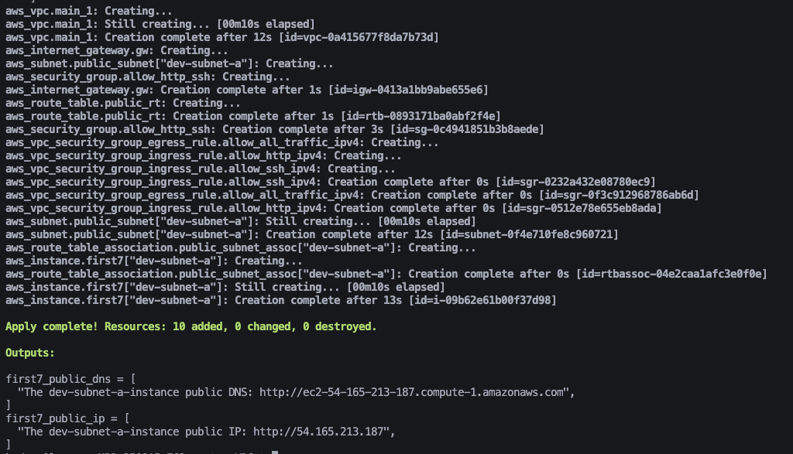
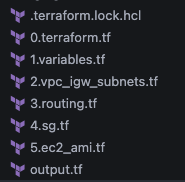
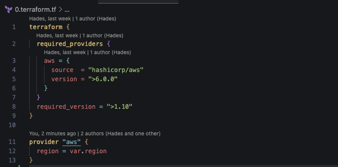
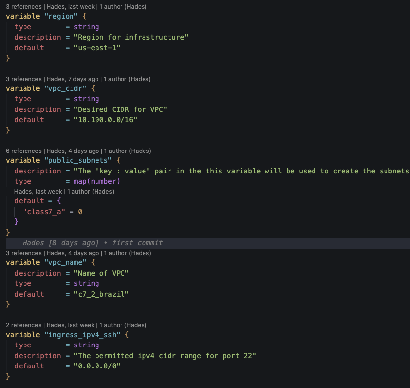
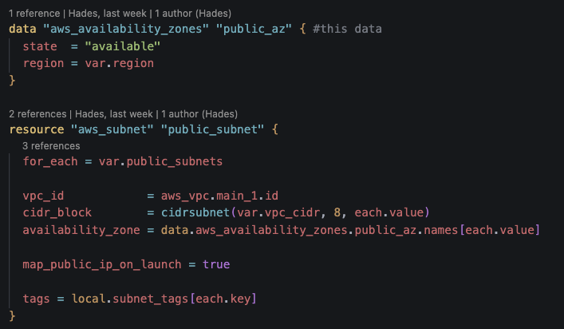
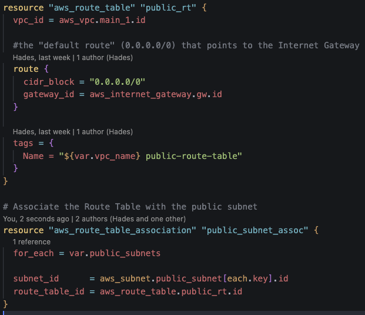
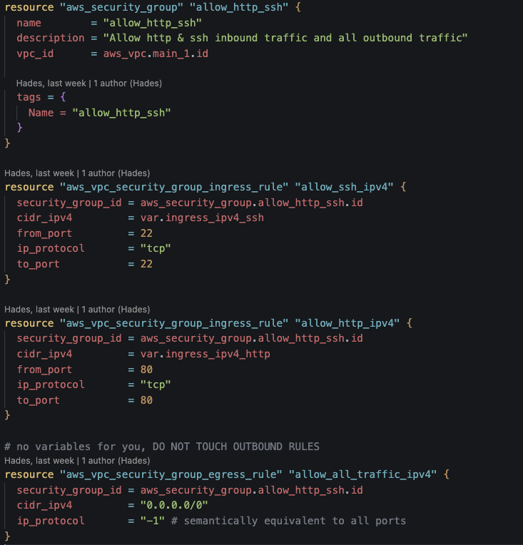
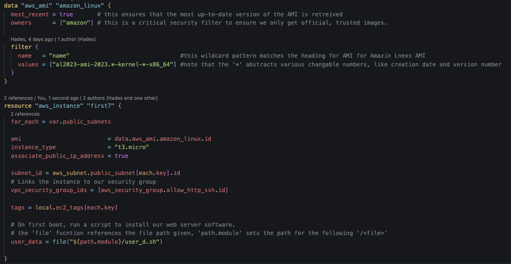
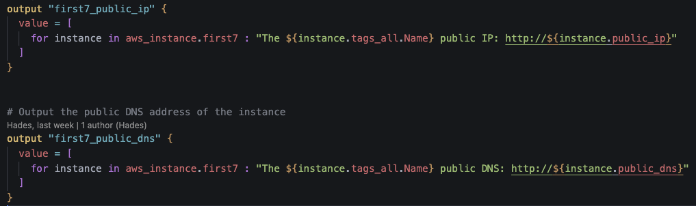

Work is progress ReadMe.....

---
# 🔥 My Simple EC2 Web Server Project 🔥

A simple yet robust Terraform project to deploy a public-facing EC2 web server on AWS. This configuration builds a complete, best-practice network foundation; from subnet(s) with security group(s), all attached to an appropriate VPC, with attached Internet Gateway  and associated routing. All built to house the launch of the created web server. 

This project was built with underlying aim to be very flexible and reusable. To accomplish this, numerous variables and local blocks were created and integrated throughout the code and the various resources used in the code. Thanks to the 'variable' nature of this code's construction, custom adjustments to the products of this terraform configuration can be achieved with simple changes in the variables/locals blocks (in the 'variables.tf' file). The notable variables and their possible adjustments will be outlined.

This project is a great starting point for understanding the core components of AWS networking and compute, all managed through Infrastructure as Code.

---

## 🏛️ Architecture: What This Code Deploys

This project doesn't just create a server; it builds your own little corner of the cloud. When you run `terraform apply`, it will provision the following resources in the correct order:

* **VPC:** A dedicated, isolated virtual network to house all our resources.
* **Internet Gateway:** The "front door" for our VPC, allowing it to communicate with the internet.
* **Public Subnet(s):** A "room" within our VPC where we can place public-facing resources. This code has the designed flexibility to adjust the number of subnets based on input variables.
* **Route Table:** The "road map" for our subnet, with a rule that directs internet-bound traffic to the Internet Gateway.
* **Security Group:** A stateful firewall for our instance. This configuration uses the modern, best-practice approach of defining an empty group and attaching individual `ingress` and `egress` rule resources to it.
* **EC2 Instance:** A t3.micro Amazon Linux 2023 server that automatically runs a startup script (`user_data`) to install a web server and host a sample webpage. The code was designed to create one of the same type of instance in each subnet created.

---

## ✅ Prerequisites

Before you begin, make sure you have the following installed and configured:

1.  **Terraform CLI:** (e.g., version `1.5.0` or higher)
2.  **AWS Account:** With an IAM user or role configured with the necessary permissions.
3.  **AWS CLI:** Configured with your credentials (e.g., by running `aws configure`).
4.  **SSH Key Pair:** A valid SSH key pair in your AWS account to allow for secure access to the instance if needed.


---

## ⚙️ Configuration (Inputs & Variables)

This project is designed to be highly configurable through the use of input variables. While the configuration will work out-of-the-box with its default values (seen in the table below), you can customize your deployment by creating a `terraform.tfvars` file and overriding the defaults. Optionally, you can directly adjusts the variable file, though that's a bit more work.

### Primary Input Variables

These are the main "knobs" you can turn to change the resulting infrastructure.

| Variable Name       | Description                                                                                                                                                                                                                                                                                                                                                                                                                                                        | Type          | Default Value      |
| :------------------ | :----------------------------------------------------------------------------------------------------------------------------------------------------------------------------------------------------------------------------------------------------------------------------------------------------------------------------------------------------------------------------------------------------------------------------------------------------------------- | :------------ | :----------------- |
| `region`            | The AWS region where all infrastructure will be deployed. And will be used by all resources requiring a defined region.                                                                                                                                                                                                                                                                                                                                            | `string`      | `"us-east-1"`      |
| `vpc_name`          | The value for the `Name` tag on the created VPC.                                                                                                                                                                                                                                                                                                                                                                                                                   | `string`      | `"c7_brazil"`      |
| `vpc_cidr`          | The primary IP address range for the entire VPC. And is used as the base for subnet CIDR creation.                                                                                                                                                                                                                                                                                                                                                                 | `string`      | `"10.190.0.0/16"`  |
| `public_subnets`    | **This is the most powerful variable.** It's a map that controls the creation of public subnets. Adding a new key-value pair to this map will automatically create a new subnet. The `key` (e.g., "class7_a") is used for the `Name` tag, and the `value` (e.g., `0`) is used to calculate a unique CIDR block and select an Availability Zone. The values must be unique and sequential, starting from 0. <br>This will also create one instance for each subnet. | `map(number)` | `{"class7_a" = 0}` |
| `ingress_ipv4_ssh`  | The source IPv4 address range allowed to connect via SSH (port 22). The default allows access from anywhere on the internet                                                                                                                                                                                                                                                                                                                                        | `string`      | `"0.0.0.0/0"`      |
| `ingress_ipv4_http` | The source IPv4 address range allowed to connect via HTTP (port 80). The default allows access from anywhere on the internet.                                                                                                                                                                                                                                                                                                                                      | `string`      | `"0.0.0.0/0"`      |

### Example `terraform.tfvars` File

To customize a deployment, you would create a file named `terraform.tfvars` with your desired values:

```hcl
# example of a terraform.tfvars fiel with code for this configuration

region     = "us-east-1"
vpc_name   = "c7_2_brazil"
vpc_cidr   = "10.190.0.0/16"

public_subnets = {
  "dev-subnet-a" = 0,
}

```

### Internal Local Values

The `locals` blocks in this configuration are used to define static values (like `owner`) and to dynamically generate a consistent set of tags for all resources based on the input variables. These are not typically meant to be changed by the user unless you are modifying the core logic of the configuration. If editing these values, please note the various references within them, as well as the reference types, to avoid errors.

---

## 📤 Outputs

The following outputs will be displayed after a successful apply:

| Name                    | Description                                                |
| :---------------------- | :--------------------------------------------------------- |
| `web_server_public_ip`  | The public IP address of the deployed EC2 web server(s).   |
| `web_server_public_dns` | The public DNS hostname of the deployed EC2 web server(s). |

---

## ⚙️ How to Use

Getting this infrastructure up and running is simple. Once you have downloaded or clone the configuration to you desired location, the basic terraform execution flow will apply.

1.  **Initialize Terraform:**
    This will download the necessary AWS provider plugin.
    ```bash
    terraform init
    ```

2.  **Review the Plan:**
    See exactly what resources Terraform will create.
    ```bash
    terraform plan
    ```

3.  **Apply the Configuration:**
    Approve the plan to build the infrastructure.
    ```bash
    terraform apply
    ```

If you run the configuration with the default settings, a successful terraform apply should give the following result in your terminal.



Once the apply is complete, check the outputs to get the public IP address of your new web server!

With a default web server that looks something like the following:


---

## 🧩Summary of the files and their Contents

The main files for this configuration are split into a few `.tf` files. I'll be going over the main files and giving some explanations of their key parts and how they work to meet the project's goals. While not a necessity when using Terraform, breaking down the code into different, appropriately-named files is a great way to make the configuration clear and more easily understandable for yourself and anyone else who reads it.



### 0.terraform.tf file



This file contains the `terraform` block, which includes the `required_providers` and `required_version` settings. These blocks define the specific versions of the AWS provider and the Terraform CLI, respectively, that this configuration is designed to work with, ensuring a consistent and predictable environment.


### 1.variables.tf file

 

This file contains the input `variable` and `locals` blocks that are referenced throughout the configuration. Note that while both input variables (referenced with `var.<NAME>`) and local values (referenced with `local.<NAME>`) can be used throughout the module, only **input variables** are meant to **receive** values from outside the module (e.g., from a `.tfvars` file).

### 2.vpc_igw_subnet.tf file 



This file contains the configuration for the foundational network components: the VPC, Internet Gateway, and the public subnets. Note the use of `var.` and `local.` references, which makes the code DRY (Don't Repeat Yourself) by centralizing configuration data.

Please note the use of the `for_each` meta-argument on the `aws_subnet` resource. This powerful feature creates multiple instances of the resource—one for each entry in the `var.public_subnets` map. With this implementation, the number of key-value pairs in the `public_subnets` variable directly controls the number of subnets created in AWS. 

Remember that the `var.subnets` refers to 'public_subnets' variable defined in the 1.variables.tf. And since its a map it perfectly fits the use case for the `for_each` meta argument. Also with this implementation, the number of values correctly placed in the "public_subnets" variable will have a direct correlation to the number of `resource "aws_subnet" "public_subnet"` blocks created, and thus the number of subnets created in AWS.

### 3.routing.tf



This file contains the `route table` and `route table association` resources that define traffic routing within the VPC. Note again, the use of the `for_each` meta-argument to produce the needed route table associations for each created subnet.

### 4.sg.tf



This file contains the resources that define the `aws_security_group` and its associated rules. These rules act as a stateful firewall for the EC2 instances. Note the use of variables within the `cidr_ipv4` argument (`var.ingress_ipv4_http` and `var.ingress_ipv4_ssh`), which allows the user to easily change the allowed source IP ranges.

### 5.ec2_ami.tf



This file contains the `data "aws_ami"` block to find a machine image and the `resource "aws_instance"` blocks to build the EC2 instances. The `for_each` meta-argument is used again to create one EC2 instance for each subnet.

The `data "aws_ami"` block is used to dynamically look up the latest official Amazon Linux 2023 AMI. It uses a `filter` with a wildcard (`*`) to match the naming pattern. The `most_recent = true` argument then ensures that Terraform selects only the newest image from the results that match the pattern.

### output.tf



This file contains `output` blocks to display the public DNS hostnames and public IPv4 addresses for each EC2 instance created by the configuration.


---

## ⚠️ Limitations

The following are some limitations i've observed with the current project:
- the number of EC2's per subnet is limited to one,
- this project can only use only two ingress rules with this configuration.
- the AMI allowed by this config is not user selectable
- the scripted used by the EC2 is not user selectable

## ✨ Potential Improvements

These are some improvements I have in mind for the project.
- the ability to vary the number of EC's for the project
- use variables to allow for user AMI selection
- use variables to make the script for the user data, user selectable
- try to me each EC2 instance generated have the ability to choose its own script for its user data.


## 📚 References

* [Terraform Documentation: AWS Provider](https://registry.terraform.io/providers/hashicorp/aws/latest/docs)
* [Terraform Documentation: `for_each` Meta-Argument](https://developer.hashicorp.com/terraform/language/meta-arguments/for_each)
* [AWS Documentation: VPCs and Subnets](https://docs.aws.amazon.com/vpc/latest/userguide/what-is-amazon-vpc.html)
* [AWS Documentation: EC2 User Data](https://docs.aws.amazon.com/AWSEC2/latest/UserGuide/user-data.html)


