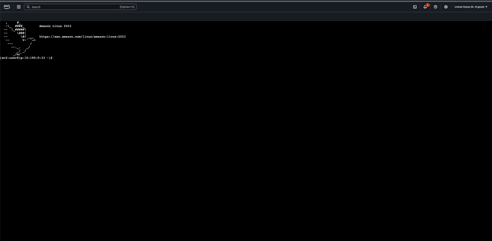

These are the steps i would take using bash commands to edit the running EC2 web server.

First thing to note is that within the script for the web server, is the path and file name that the web server html code will be housed in on the EC2 instance, i.e. the **'/var/www/html/index.html'**.


-----


These are the steps for using a bash command-line shell to edit the running EC2 web server's `index.html` file; with the target file located at `/var/www/html/index.html`.

1.  **Connect to the Instance via SSH** ➡️

      * Connect to the EC2 instance using a service like AWS EC2 Instance Connect or a standard SSH client. Ensure the associated security group has an inbound rule allowing traffic on port 22.

2.  **Navigate to the Web Root Directory** 📂

      * Once connected to the instance, change to the directory containing the `index.html` file.
        ```bash
        cd /var/www/html/
        ```

3.  **Verify Location and File Presence** ✅

      * Confirm you are in the correct directory using the `pwd` (print working directory) command.
      * Confirm the `index.html` file is present using the `ls` (list) command.

4.  **Open the File for Editing** ✍️

      * Run the command `sudo vim index.html` to open the file with the necessary elevated permissions.
          * **`sudo`**: This elevates your permissions to allow editing of a system file owned by the root user.
          * **`vim`**: A powerful, standard command-line text editor.

5.  **Edit the File in Vim**

      * Press the `i` key to enter **INSERT** mode. You will see `-- INSERT --` at the bottom of the screen. You can now type and make your edits.
      * E.g. Here you can make your desired edits, such as adding the text: *"I found my wife on a party yacht in Thailand\! Her name is Yuki (Japanese-Brazilian)"*
      * Or inserting an image.
      * Once you are finished editing, press the `Esc` key to exit INSERT mode and return to command mode.

6.  **Save and Exit Vim**

      * With the cursor at the bottom of the screen, type the following command and press **Enter**:
        ```bash
        :wq
        ```
          * **`:`** enters the command-line mode in Vim.
          * **`w`** stands for **write** (save the file).
          * **`q`** stands for **quit** (exit Vim).

7.  **Verify Your Changes**

      * Refresh the webpage in your browser using the instance's public IP or DNS name. Your changes should now be live.

Below are images show casing the initial webpage, the bash steps to edit the running web server, followed by the results of the changes on the running web server.

- Successfully running web server:


- Accessing AWS Instance Connect to connect to the instance via SSH:


- Successful connection to the running instance


- Navigating to the necessary file location (directory):


- Using VIM to access and edit the file with root permissions:


- Editing the .html file on the running instance:


- Saving and exiting the .html file


- Successfully edited, running, web server instance
